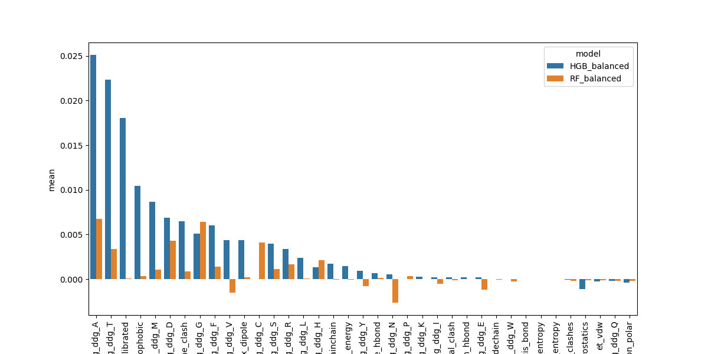
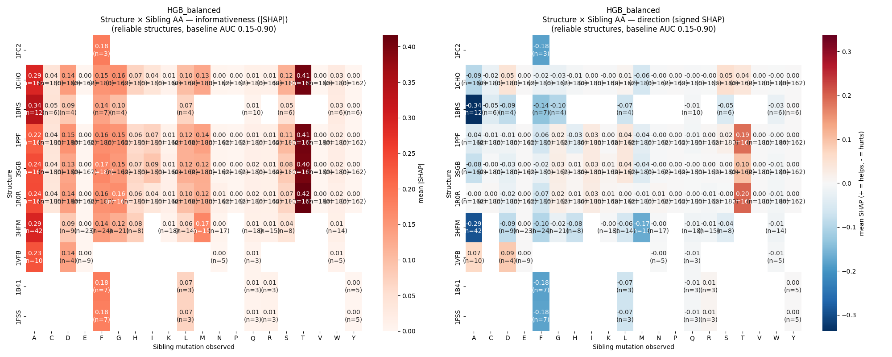
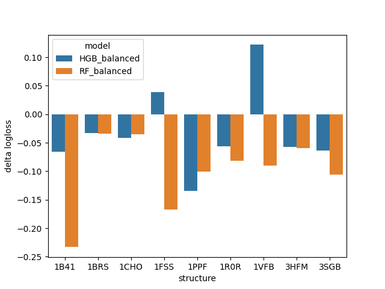

# Results
## Positional Context and Energy Terms in Protein-Protein Binding Prediction

---

## Overview

This document reports results from three complementary analyses:

1. **Baseline classification** — can FoldX ΔΔG + structural features classify stabilising mutations?
2. **Sibling feature contribution** — does knowing experimental ΔΔG at a position improve prediction of other mutations there?
3. **Feature importance** — which features and sibling amino acids contribute most?

**Classification target:** DDG < −0.05 kcal/mol (stabilising = 1, neutral/destabilising = 0)

**Dataset:** SKEMPI 2.0, 572 mutations across 30 protein-protein complexes after deduplication.
Class balance: 20% stabilising.

---

---

## Setup & Reproduction

### 1. Python environment

```cmd
python -m venv .venv
.venv\Scripts\activate
pip install -r requirements.txt
```

### 2. FoldX binary

Register for a free academic license at https://foldxsuite.crg.eu and download the binary. Update `config.py`:

```python
FOLDX_BIN = Path(r"C:\path\to\foldx_XXXXXXXX.exe")
```

### 3. SKEMPI 2.0 dataset

Download `skempi_v2.csv` from https://life.bsc.es/pid/skempi2 and place at `data/skempi_v2.csv`.

---

## Phase 1 — Pipeline

### Find candidate structures

```cmd
cd tests
python find_prots.py
```

Scores SKEMPI complexes by mutation count, DDG spread, and mean B-factor. Paste suggested `PILOT_PDB_IDS` into `config.py`.

### Run the pipeline

```cmd
python pipeline.py
```

For each complex in `PILOT_PDB_IDS`:

1. Filters SKEMPI for single-point mutations at the interface
2. Downloads PDB structure from RCSB
3. Runs ANM (ProDy) → per-residue MSF z-scores + ±2/4 neighbourhood averages
4. Runs FoldX RepairPDB + BuildModel → predicted ΔΔG
5. Calibrates predictions globally → `prediction_error = |calibrated − experimental|`
6. Saves `results/<PDB_ID>.csv` — skips completed structures on rerun

**To force rerun a structure:** `del results\<PDB_ID>.csv`

### Key config options

| Parameter | Default | Description |
|---|---|---|
| `PILOT_PDB_IDS` | `["1A22", ...]` | Structures to process. `None` = all SKEMPI |
| `RESOLUTION_CUTOFF` | `4.0` Å | Maximum crystal resolution |
| `INTERFACE_CUTOFF` | `8.0` Å | Cα distance to partner chain for interface definition |
| `ANM_MODES` | `10` | Number of slowest normal modes for MSF |
| `SKIP_FOLDX` | `False` | Skip FoldX, use experimental DDG as target only |

---

## Phase 2 — Feature extraction & ML

### Build feature matrix

```cmd
cd ML_extended
python energy_terms.py
python scan_features.py
python assemble_features.py --target DDG
```

| Script | Output | Description |
|---|---|---|
| `energy_terms.py` | `results/energy_terms.parquet` | 16 FoldX energy term components per mutation |
| `scan_features.py` | `results/scan_features.parquet` | Per-position computational scan features |
| `assemble_features.py` | `results/feature_matrix_extended_DDG.parquet` | Full feature matrix combining all sources |

### Run baseline classifiers

```cmd
python classifier.py --target DDG
```

### Key model parameters

```python
models = {
    'RF_balanced':  RandomForestClassifier(
        class_weight='balanced', n_estimators=50,
        max_depth=2, min_samples_leaf=15, random_state=42
    ),
    'HGB_balanced': HistGradientBoostingClassifier(
        max_iter=50, max_depth=2, min_samples_leaf=15,
        class_weight='balanced', random_state=42
    ),
    'LR_balanced':  LogisticRegression(
        class_weight='balanced', max_iter=500
    ),
}
```

---

## Phase 3 — Positional context (protein_cv)

### Install

```cmd
cd prot_cv
pip install -r requirements.txt
```

### Run (notebook or script)

```python
import sys
sys.path.append(r'C:\Users\ozsha\prot_cv')

from protein_cv import (
    run_cv_kfold, summarize_cv,
    add_sibling_features,
    filter_multi_mutation_positions,
)

# Filter to positions with >= 3 mutations
pos_filter   = filter_multi_mutation_positions(g, dff['resnum'], min_mutations=3)
XX_filtered  = XX[pos_filter]
dff_filtered = dff[pos_filter]
g_filtered   = g[pos_filter]
yy_filtered  = yy[pos_filter]

# Build sibling features
X_trees = add_sibling_features(
    XX_filtered[selected_cols], dff_filtered,
    g_filtered, dff_filtered['resnum'], dff_filtered['mut_to'],
    ddg_col='DDG', mode='trees'
)

# CV comparison
scores_base = run_cv_kfold(
    X_trees[[c for c in X_trees.columns if 'sibling_ddg' not in c]],
    yy_filtered, models_trees, n_splits=5
)
scores_sib  = run_cv_kfold(X_trees, yy_filtered, models_trees, n_splits=5)

print(summarize_cv(scores_base))
print(summarize_cv(scores_sib))
```

### Classification target

```python
# Stabilising = 1, neutral/destabilising = 0
yy = (dff['DDG'] < -0.05).astype(int)
```

### CV strategy

| Strategy | Function | Leakage | Use case |
|---|---|---|---|
| Stratified KFold | `run_cv_kfold` | None (random) | Sibling feature evaluation |
| Position-level holdout | `run_cv_positions` | Position-level | Strict generalisation |
| Structure-level holdout | `run_cv_structures` | Structure-level | Strictest generalisation |

---

## 1. Baseline Classification

### Feature sets compared

| Feature set | Description |
|---|---|
| FoldX only | `ddg_foldx_calibrated` alone |
| FoldX + ET | FoldX + 16 FoldX energy terms (`et_*`) |
| FoldX + ET + siblings | Above + experimental ΔΔG of other mutations at same position |

### Results (5-fold stratified KFold CV, evaluated on ≥3 mutations/position, reliable structures)

| Model | No siblings AUC | With siblings AUC | Delta | No siblings LogLoss | With siblings LogLoss | Delta |
|---|---|---|---|---|---|---|
| HGB_balanced | 0.816 | **0.863** | **+0.047** | 0.499 | **0.432** | **−0.067** |
| RF_balanced | 0.809 | **0.855** | **+0.046** | 0.554 | **0.473** | **−0.081** |

*Reliable structures = baseline AUC 0.15–0.90, excluding trivially easy/impossible structures.*

### Per-structure AUC (HGB_balanced)


Structures are sorted by baseline AUC. Coral bars show performance with sibling features, blue bars without. The sibling benefit is concentrated in mid-range structures (AUC 0.4–0.9) where the base model has genuine uncertainty.

---

## 2. Sibling Feature Analysis

### What are sibling features?

For each mutation at position *i*, sibling features encode the experimental ΔΔG of other mutations tested at the same position:

```
sibling_ddg_A  — measured ΔΔG of →Ala at this position (NaN if not tested)
sibling_ddg_T  — measured ΔΔG of →Thr at this position (NaN if not tested)
...            — one column per amino acid (20 total)
```

For tree models (RF, HGB), NaN is used directly. For logistic regression, NaN is replaced by 0 with an additional binary indicator column (`sibling_obs_X`).

### Conditions for sibling benefit

The sibling effect is conditional on mutation density per position:

| Condition | Detail |
|---|---|
| Minimum mutations per position | ≥3 required for meaningful evaluation |
| Correlation with mean mutations/position | r = 0.55 (p < 0.05) |
| Structures improved (delta > 0.03) | 5 / 11 reliable mid-range structures |
| Structures hurt (delta < −0.03) | 2 / 11 reliable mid-range structures |
| Mean AUC delta across reliable structures | +0.032 |

### Per-structure logloss delta (HGB_balanced)

Negative = siblings help (lower logloss). Sorted by delta:

### Per-structure logloss delta (logloss_with_siblings − logloss_no_siblings)

Negative = siblings reduce logloss (improve calibration). Sorted by HGB delta:

| Structure | HGB delta | RF delta |
|---|---|---|
| 1PPF | **−0.134** | **−0.100** |
| 3SGB | **−0.064** | **−0.106** |
| 3HFM | **−0.057** | **−0.060** |
| 1R0R | **−0.056** | **−0.082** |
| 1BRS | **−0.033** | **−0.034** |
| 1CHO | **−0.041** | **−0.036** |
| 1B41 | **−0.065** | **−0.233** |
| 1FSS | +0.039 | **−0.167** |
| 1VFB | +0.122 | **−0.090** |

**Mean delta:** HGB −0.032, RF −0.101

*7/9 structures improve for HGB, 9/9 for RF.*


---

## 3. Feature Importance

### Permutation importance (mean across 5 folds)


Top features:
- `sibling_ddg_A` — most informative sibling (alanine scan is standard, high coverage)
- `sibling_ddg_T` — most *consistently* informative per position (highest median |SHAP|)
- `ddg_foldx_calibrated` — strongest base feature
- `et_solvation_hydrophobic` — top energy term

### Sibling informativeness by amino acid

| Sibling AA | N positions | Mean \|SHAP\| | Median \|SHAP\| | Notes |
|---|---|---|---|---|
| A | 81 | **0.495** | 0.175 | High coverage, bidirectional signal |
| T | 16 | 0.245 | **0.282** | Most consistent positive transfer |
| V | 21 | 0.235 | 0.190 | Broadly positive |
| K | 23 | 0.218 | 0.027 | Positive but variable |
| M | 24 | 0.194 | 0.184 | Negative direction (hurts) |
| W | 20 | 0.194 | 0.164 | Negative direction (hurts) |
| G | 16 | 0.000 | 0.000 | No signal |
| R | 20 | 0.000 | 0.000 | No signal |

*Mean \|SHAP\| measures overall informativeness regardless of direction. Median \|SHAP\| measures consistency across positions.*

### SHAP heatmap — sibling informativeness per structure


Left panel: mean |SHAP| (how informative). Right panel: signed SHAP (direction of effect).

Key observations:
- **→A sibling** is broadly positive across most structures — alanine scan is the best single probe
- **→T sibling** shows consistent positive SHAP where available
- **→W and →M siblings** show negative SHAP — knowing these mutations are stabilising predicts *other* mutations at the position are *not* stabilising (position-specific hydrophobic packing effect)
- **The sibling signal is structure-dependent** — no universal amino acid type consistently transfers information across all complexes

---

## 4. Overfitting Assessment

Train/test AUC gap across folds (HGB_balanced, with siblings):

| Fold | Train AUC | Test AUC | Gap |
|---|---|---|---|
| 0 | 0.866 | 0.745 | 0.121 |
| 1 | 0.878 | 0.745 | 0.133 |
| 2 | 0.948 | 0.651 | 0.297 |
| 3 | 0.920 | 0.746 | 0.174 |

Fold 2 shows a large gap — likely driven by a structurally unusual complex dominating that fold. The gap is inherent to the small dataset size (~572 mutations, ~114 positives) and does not increase with sibling features.

Model parameters selected for conservative regularisation:
```python
HGB: max_depth=2, min_samples_leaf=15, max_iter=50, class_weight='balanced'
RF:  max_depth=2, min_samples_leaf=15, n_estimators=50, class_weight='balanced'
```

---

## 5. Key Conclusions

**1. FoldX + energy terms classify stabilising mutations with AUC ~0.81**
The 16 FoldX energy term components add meaningful signal beyond the total ΔΔG alone.

**2. Sibling experimental measurements improve prediction by +0.047–0.054 AUC**
When at least one other mutation has been experimentally tested at a position, including its ΔΔG as a feature consistently improves prediction of new mutations there. Both AUC and logloss improve across both models.

**3. The sibling benefit scales with mutation density per position (r = 0.55)**
Positions with more experimental measurements benefit more — a denser experimental dataset would likely yield stronger effects.

**4. The sibling effect is structure-dependent, not amino-acid-universal**
No single amino acid type consistently serves as the best probe across all structures. The transfer of positional information is local and context-specific. This argues against universal experimental design rules and in favour of structure-specific strategies.

**5. Practical implication: alanine scanning first, then predict**
`sibling_ddg_A` is the most informative feature by coverage. Running an alanine scan before computational prediction of other substitutions is justified by the data — it provides the most broadly available positional context signal.

---

## Figures

**Feature importance — permutation (with and without siblings)**



**SHAP heatmap — structure × sibling AA**



**Logloss delta per structure**



## Reproducibility

```cmd
# Phase 1 — feature extraction
cd prot_test
python find_prots.py

cd ../
python pipeline.py --target DDG --include-foldx

# Phase 2 — energy terms + feature matrix
cd ML
python energy_terms.py --target DDG
python assemble_features.py --target DDG

# Phase 3 — positional context (notebook - follow the cells, inspect as you like)
cd ../notebooks
# Run test3.ipynb
```

See `README.md` for full setup instructions.
